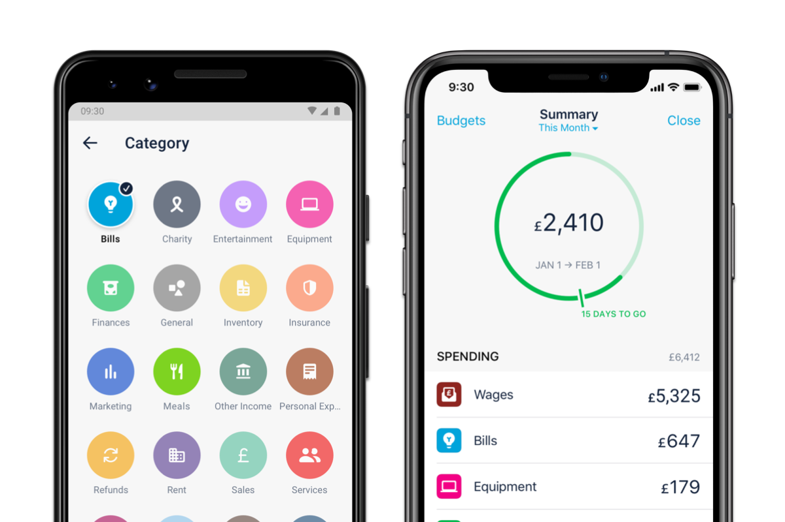
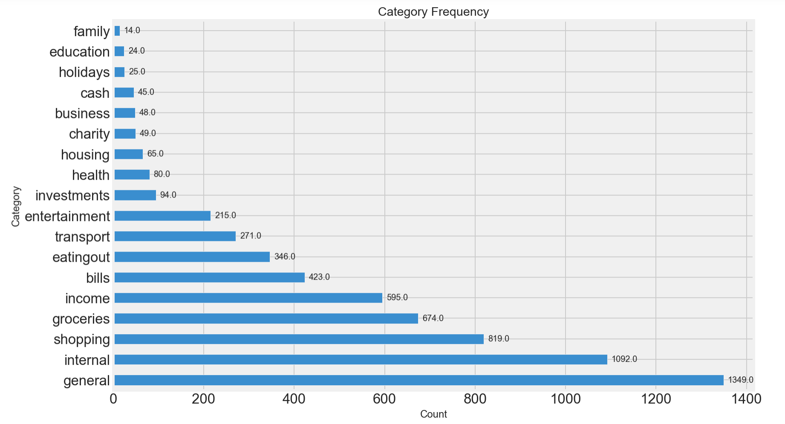
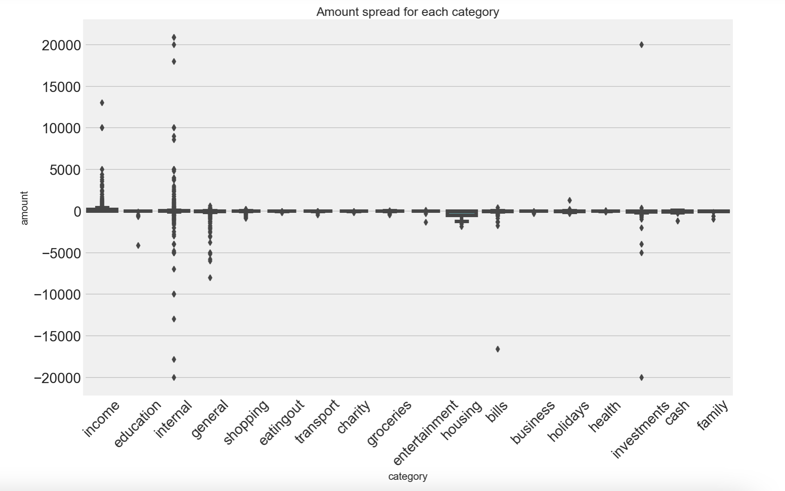
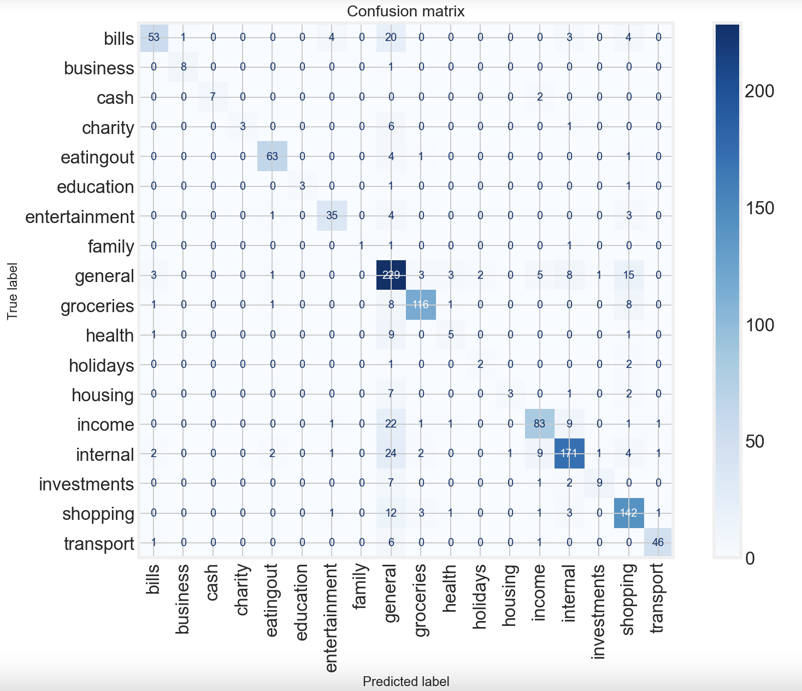
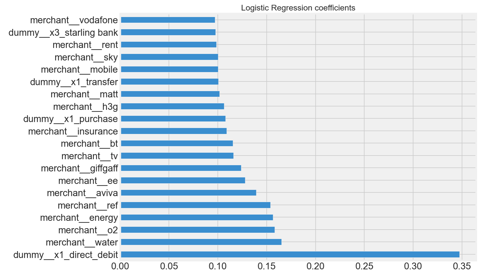
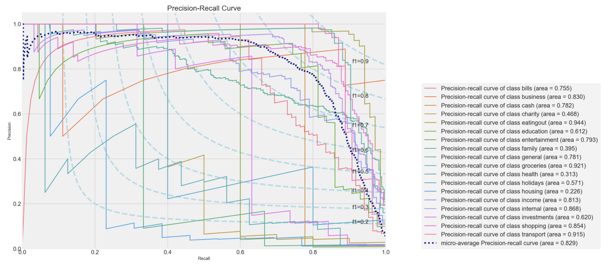
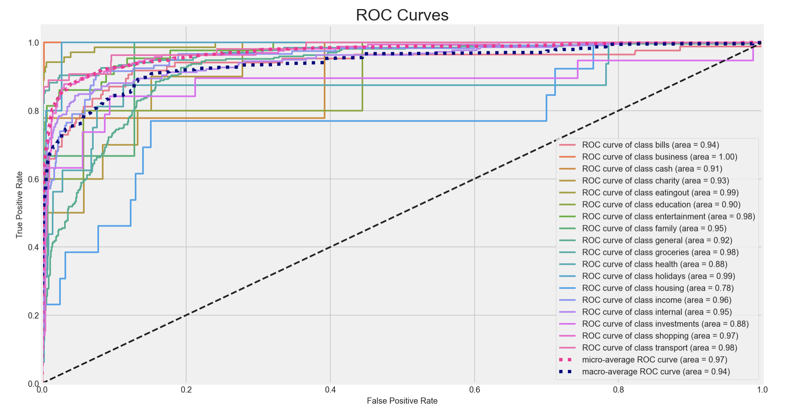

# Financial transactions classification - GA Capstone Project

This project was done as part of the General Assembly's Data Science Immersive course taken from March to June 2021.

## Context and goals

After working for a few years in the financial industry, I realised how managing cash flow is an essential skill that companies need to master. More than companies, it can be a nightmare for individuals to follow their day-to-day transactions and be able to categorise different types of spending, especially as transaction details and descriptions on bank statements are far from being straightforward.

While researching different ways several players have addressed the issue and talking to industry experts, it appeared that traditional finance has yet to implement features to automatically classify transactions into specific categories. 

This project aims to:
- examine different banking transactional features in order to predict and determine such categories for each transaction
- reproduce ML solutions provided by fintech companies to classify transactions




## Data acquisition and cleaning

I received my dataset from a financial tech company that compiles financial transactions from different online banking APIs and classifies each transaction in a range of categories.

The data was received in csv format and saved in a SQLite database. 
The data has been provided in 4 csv files:
- transactions: table of banking transactional data with 5 features including merchant, amount, currency, transaction_type and category,
- account: table providing account types and names
- bank_connection: table that enables to link the bank and account tables
- bank: table providing bank types and names

After extracting and merging the tables from the database, exploratory data analysis was performed through cleaning and visualising variables. The data was prepared for modelling by removing duplicates, outliers, unrelevant columns and missing values. All values occuring only once were removed for simplicity and to avoid issues on predictions when splitting the data. 

After cleaning, the dataset had 6228 transactions (rows) and 8 features (columns). It displays transactions from 533 distinct accounts and corresponds to transactions over the course of a week in January 2021.

Among the 8 features, predictor variables are as follows:

| Name | Description | Type | 
| :--- | :--- | :--- |
| merchant | description of the transaction provided by the bank | string variable | 
| amount | continuous variable with the amount and sign of the transaction | float - continuous variable |
| currency | type of currency | string - categorical variable |
| transaction_type | type of transaction within each bank | string - categorical variable |
| account_type | type of account which includes checking, savings and cryptocurrency accounts | string - categorical variable |
| bank_type | type of bank which encompasses traditional banks, credit card accounts and cryptocurrency exchanges | string - categorical variable |
| bank_name | name of the bank | string - categorical variable |

These enable us to predict our target variable:

| Name | Description | Type | 
| :--- | :--- | :--- |
| category | type of spending classified in specific categories | string - categorical variable |

This project aims to predict all 18 classes from the **category** variable. All features were kept in order to reproduce real life predictions and simulate whether statistical models can accurately predict these classes. 

As a result, the baseline for modelling is 0.22.

 

In this dataset, it is complicated to use correlation functions, heatmaps or pairplots because variables are all categorical and non numerical apart from the amount variable.

 

The boxplot above shows that some categories have significantly more widespread amounts and that most categories correspond to spendings and therefore have negative amounts. 


## Feature engineering

The analysis was divided in two parts: the first part using only categorical variables and the second part using feature engineering and NLP pre-processing on the merchant description of the transaction. 

### PART I - Categorical variables

In order to prepare the data for PART I, the following steps were applied:
- Feature selection: categorical variables and the amount variable were selected
- Dummification: categorical variables were dummified
- Train-test split: an 80/20 train-test split was applied to the data
- Standardisation: the data was standardised using a StandardScaler or a MinMaxScaler (for Naive Bayes modelling)

After dummification, the number of features increased to 53.

### PART II - Full dataset

In order to prepare the data for PART II, the following steps were applied:
- Feature selection: all variables including the merchant's description were selected
- Train-test split: an 80/20 train-test split was applied to the data
- Column transformations: a ColumnTransformer was applied including several steps
    - CountVectorizer: each word from the merchant variable was countvectorized and it was decided to keep words that occur at least twice. English stopwords were added but additional lists of words and experimenting with 'ngram_range' would be needed to complete the analysis 
    - OneHotEncoder: categorical variables were onehotencoded (dummified)

After pre-processing, the number of features increased to 1682.

The final model pipeline consited of:

1. ColumnTransformer including:
    - CountVectorizer
    - OneHotEncoder
2. StandardScaler
3. Classification model


## Modelling (Machine Learning)

After preparing the data, a range of machine learning classification algorithms were deployed to reproduce the classification of transactions as computed for the app feature. 
Models for multi-class classification such as Logistic Regression, KNeighbors, Decision Trees, Random Forests, Support Vector Machines and Naive Bayes were tested and tuned resulting in accuracy scores well above baseline.

### PART I - Categorical variables

In PART I, a range of models were tested on the prepared data and below is a recap of the mean CV scores from each model:

| Model | CV score | 
| :--- | :--- |
| Logistic Regression | 0.423 |
| KNeighbors | 0.478 |
| Decision tree | 0.469 |
| Random forest | 0.474 |
| SVC | 0.451 |
| MultinomialNB | 0.406 |
| Bagging with Logistic Regression | 0.412 |
| Bagging with KNeighbors | 0.506 |
| Bagging with Decision tree | 0.495 |
| AdaBoost with Logistic Regression | 0.279 |
| AdaBoost with Decision tree | 0.465 |
| AdaBoost with SVC | 0.346 |
| Gradient Boosting | 0.46 |
| Voting | 0.485 |
| Stacking | 0.486 |

The best mean CV score of 0.51 was achieved with KNeighbors classifier passed through a bagging classifier. The variance-bias trade-off and differences between ensemble models were analysed. As expected, stable classifiers (LogisticRegression and SVC) performed poorly with bagging and boosting, while unstable classifiers had better predictions and scores, both as simple models and within ensemble methods. However, interpretability is limited as KNeighbors is the best model and categorical variables which include transaction type, account type, bank name and bank type, are not expected to be great predictors.

### PART II - Full dataset

In Part II, similar models were tested again to check for improvements due to the NLP pre-processing. The high number of features made the analysis a lot more complex and some gridsearch models had to be stopped due to time constraints. Therefore, a wide range of modelling techniques were used with fairly simple parameters and scores could be further increased with more time and/or computing power.

| Model | CV score | 
| :--- | :--- |
| Logistic Regression | 0.787 |
| KNeighbors | 0.765 |
| Decision tree | 0.737 |
| Random forest | 0.772 |
| SVC | 0.735 |
| MultinomialNB | 0.728 |
| Bagging with Logistic Regression | 0.733 |
| Bagging with KNeighbors | 0.791 |
| Bagging with Decision tree | 0.743 |
| AdaBoost with Decision tree | 0.639 |
| AdaBoost with SVC | nan |
| Gradient Boosting | 0.759 |
| Voting | 0.767 |
| Stacking | 0.793 |

As a result, the pre-processing of the merchant's description significantly increased the scores and the best ensemble model reached a mean CV score of 0.79. 

 

Logistic Regression reached a mean CV score of 0.787 compared to 0.792 for the stacking classifier. It was selected as the best model for its better interpretability when compared to ensemble models. On the test set, the model ended up predicting 979 true positives out of 1246 observations. It was observed that most of the wrongly predicted values belonged to the general class. This was expected as it is the largest as well as the default class where transactions are classified when not assigned to other classes. Other misclassifications occurred between groceries and shopping as they are similar classes. It also happened between internal and income classes as they are the only classes with a wide range of positive values.

 

The analysis enabled us to better understand how and why variables influence predictions. The NLP pre-processing created features that are strong predictors of certain classes. For instance, words such as "water", "o2", "energy", "aviva", "ee", "giffgaff", "tv", "bt", "sky", "vodafone" or "insurance" appear to be strong predictors of the bills class while "rent" is a positive coefficient for the housing class.

The trade-off between recall and precision can be seen in the graph below.



The model calculated an optimum point for the General class where precision=0.63 and recall=0.85 for the test data. The trade-off can be easily visualised. If we were to change the threshold and increase the precision to 0.8, the recall would then drop to 0.45 and below and the number of false negatives would increase. Lower classes such as charity, family, health, holidays and housing are much more volatile due to the low number of observations and we would need more data to increase their scores.



Both ROC and Precision-Recall curves have high area under the curve for most clasees. This demonstrates high performance across the classification thresholds.

## Limitations and next steps

In order to enhance the model and to deal with the strong imbalance in the dataset, undersampling and oversampling were applied with Logistic Regression. However, these additional methods did not improve the model. While the model's best scores are well above baseline, a number of limitations and next steps should be mentioned:

- Increasing the number of observations will contribute to the robustness of the model. The amount of data is not sufficient to properly analyse patterns within a population and draw from relationships or networks between users.
- The NLP pre-processing was applied to every word which occurred at least twice in the dataset and could be adjusted to specific groups or lists of words. The real app holds lists of keywords and applies specific rules to speed up classification. For instance, if the merchant's decription includes "Sainsbury's" or "Tesco", the transaction would automatically be classified in the groceries class. Adding such rules would further improve the model.
- The timeframe was not provided, which prevented from carrying timeseries and seasonality analysis.
- Some classes could be grouped together in order to reduce the number of classes and strengthen predictions as well as deal with the class imbalance.
- Due to time constraints, most of the models' gridsearch parameters had to be simplified because they were taking too long to run. As a result, the full project's gridsearches would have to be run again in order to get optimal results.
- Methods such as principal component analysis, clustering or neural networks were not explored due to time constraints and further analysis would be needed to improve the model.
- Finally, using cloud computing services such as instances on Amazon Web Services to increase the computational power will reduce the waiting time for models to run.

DISCLAIMER: the data has been anonymised and no private banking data is displayed.

## Conclusions and key learnings

A number of limitations and next steps were outlined and further analysis coupled with additional data will be required to improve the model and maximise the results. A future project will be to create a web application to visualise results and to apply our findings to new data. This would make the results interactive and keep improving the model. 

Key takeaways from this project are as follows:
- Without using cloud computing machines, fine-tuning on large datasets needs to be done using trial-by-error method as large gridsearches will take too long to run.
- Using NLP pre-processing on the merchant description of transactions, our model managed to predict 79% of categories right. As a result, adding more data coupled with rules and groups of words related to each category will increase our predictions accuracy even further.

Overall, this project successfully predicted and classified transactions into specific categories using several pre-processing techniques and machine learning algorithms.

## Required dependencies and how to run the project

In order to run the project, some Python librairies need to be installed:

```
pandas
numpy
matplotlib
scikitplot
seaborn
joblib
sqlite3
sklearn
imblearn
```

As previously mentioned, some models were quite computationally intensive. As a result, all parameters and results from our machine learning models were saved using 'joblib'. In order to make the analysis quicker, one needs to:
- run all cells up to 5.2 (simple classification models)
- run 6.1 (feature engineering) and the first two cells of 6.2 (simple classification models with unrestricted vocabulary)
- run the reload cells (reload and reassign names) that can be found in the conclusion parts (5.6 and 6.6) in order to get all results from this project
- run any other cell as needed to reload graphs and tables